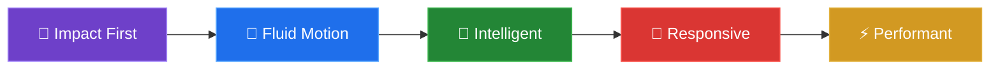
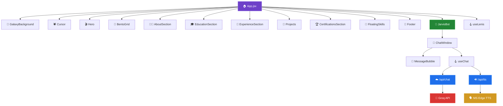

<div align="center">

<!-- Animated Header Banner -->


<br/>

<!-- Typing Animation -->
<a href="https://portfolio-v-smoky.vercel.app/">
  
</a>

<br/>

<!-- Badges Row 1 — Live & Status -->
[](https://portfolio-v-smoky.vercel.app/)
[](https://vercel.com)
[](https://portfolio-v-smoky.vercel.app/)

<!-- Badges Row 2 — Tech -->


<br/>

<!-- Separating Line -->


</div>

## 🎯 Overview

**Portfolio-V** is not just a portfolio — it's a **cinematic, AI-powered digital experience** engineered to push the boundaries of what a personal website can be. Built with **React 19**, **Three.js**, and **Vercel Serverless Functions**, it features a conversational AI assistant with real-time neural voice synthesis, a physics-based spider cursor, an interactive 3D galaxy, and dozens of handcrafted premium animations.

> _"Designed to leave an impression that lasts long after the browser tab is closed."_

<br/>

<div align="center">

<!-- Feature Icons Grid -->
| 🌌 Galaxy Background | 🕷️ Spider Cursor | 🤖 Nova AI Assistant | 🍱 Bento Grid |
|:---:|:---:|:---:|:---:|
| Canvas-rendered deep space with nebulae, twinkling stars & shooting stars | Physics-based 8-leg IK spider with web threads & magnetic snapping | Groq LLM-powered chat with streaming + real-time Neural TTS voice | Modern responsive card layout with wallpaper gallery, music player & video |

| 🫧 Floating Skills | 🎬 Horizontal Scroll | ✨ Scroll Animations | 🎵 Integrated Music |
|:---:|:---:|:---:|:---:|
| Canvas physics engine – bubbles with cursor repulsion, glow & collision | GSAP-pinned horizontal project showcase with parallax cards | Framer Motion + GSAP stagger reveals, blur transitions & spring physics | Built-in NEFFEX player with visualizer bars and album art rotation |

</div>

<br/>

---

## 🏗️ Architecture & Tech Stack

<div align="center">

```
┌──────────────────────────────────────────────────────────────────┐
│                        PORTFOLIO-V ARCHITECTURE                  │
├──────────────────────────────────────────────────────────────────┤
│                                                                  │
│   ┌─────────────┐    ┌──────────────┐    ┌───────────────────┐  │
│   │  React 19   │───▶│  Vite 7 HMR  │───▶│   Vercel Edge    │  │
│   │  Frontend   │    │  Dev Server  │    │   Deployment     │  │
│   └──────┬──────┘    └──────────────┘    └───────────────────┘  │
│          │                                                       │
│   ┌──────┴──────────────────────────────────────────────┐       │
│   │                   Component Layer                    │       │
│   ├────────────┬────────────┬─────────────┬─────────────┤       │
│   │    Hero    │ BentoGrid  │  Projects   │   Footer    │       │
│   │  (Video)  │  (Cards)   │ (H-Scroll)  │ (Parallax)  │       │
│   ├────────────┼────────────┼─────────────┼─────────────┤       │
│   │GalaxyBg   │ FloatSkills│DetailedSects│  JarvisBot  │       │
│   │(Canvas)   │ (Physics)  │(Edu/Exp/Cert│  (AI Chat)  │       │
│   ├────────────┴────────────┴─────────────┴─────────────┤       │
│   │        Spider Cursor (Canvas IK + Web Physics)       │       │
│   └──────────────────────────┬───────────────────────────┘       │
│                              │                                   │
│   ┌──────────────────────────┴───────────────────────────┐      │
│   │              Serverless API Layer (Vercel)            │      │
│   ├──────────────────────┬───────────────────────────────┤      │
│   │   /api/chat.js       │   /api/tts.js                 │      │
│   │   Groq LLM Stream    │   MS Edge Neural TTS          │      │
│   │   (qwen3-32b)        │   (en-IN-NeerjaNeural)        │      │
│   └──────────────────────┴───────────────────────────────┘      │
│                                                                  │
│   ┌──────────────────────────────────────────────────────┐      │
│   │              Animation & Physics Engines              │      │
│   ├────────────┬────────────┬─────────────┬──────────────┤      │
│   │Framer Motion│   GSAP   │  Lenis      │ Three.js     │      │
│   │(Transitions)│(ScrollTr)│(SmoothScrol)│ (R3F/Drei)   │      │
│   └────────────┴────────────┴─────────────┴──────────────┘      │
└──────────────────────────────────────────────────────────────────┘
```

</div>

### 🔧 Core Technologies

<table>
<tr>
<td width="50%">

**Frontend Framework**
| Technology | Purpose |
|:--|:--|
|  | Component architecture & state management |
|  | Lightning-fast HMR & optimized builds |
|  | Utility-first responsive styling |
|  | Advanced CSS preprocessing |

</td>
<td width="50%">

**Animation & 3D**
| Technology | Purpose |
|:--|:--|
|  | 3D galaxy rendering via R3F + Drei |
|  | Page transitions, gestures & layout animations |
|  | ScrollTrigger pinning & stagger animations |
|  | Buttery-smooth native scroll |

</td>
</tr>
<tr>
<td width="50%">

**AI & Backend**
| Technology | Purpose |
|:--|:--|
|  | Ultra-fast LLM inference (qwen3-32b) |
|  | Serverless chat & TTS endpoints |
|  | Neural voice (en-IN-NeerjaNeural) |

</td>
<td width="50%">

**Development Tools**
| Technology | Purpose |
|:--|:--|
|  | Code linting & quality |
|  | CSS transforms & autoprefixer |
|  | Cross-browser compatibility |

</td>
</tr>
</table>

---

## ✨ Feature Deep Dive

### 🌌 1. Immersive Galaxy Background
> A full-viewport **canvas-rendered deep space** environment that lives behind all content.

- **Twinkling stars** with randomized colors (`#ffffff`, `#ffe9c4`, `#d4fbff`) and soft drift velocities
- **Nebula system** — three radial gradient nebulae (purple, cyan, pink) blended via `screen` composite mode
- **Shooting stars** with fade-in/fade-out lifecycle, diagonal/vertical trajectories, gradient tails & glowing heads
- Auto-scales on window resize with density proportional to viewport area

### 🕷️ 2. Physics-Based Spider Cursor
> A **custom canvas cursor** that replaces the default mouse pointer with a fully animated spider.

- **8-leg Inverse Kinematics** — each leg independently steps using quadratic easing with knee joints
- **Magnetic snapping** — spider gravitates toward interactive elements (`<a>`, `<button>`, `<input>`)
- **Web thread rendering** — silk threads with sag physics connect the spider to nearby targets
- **Click ripples** — expanding ring animations on mouse click
- **Breathing animation** — subtle abdomen expansion/contraction cycle
- Desktop-only with graceful mobile fallback to system cursor

### 🤖 3. Nova — AI Voice Assistant
> An **AI-powered chat assistant** with real-time voice synthesis, embedded directly in the portfolio.

- **Groq LLM Backend** — Serverless API streaming `qwen3-32b` model responses via SSE
- **Neural TTS** — Microsoft Edge's `en-IN-NeerjaNeural` voice with SSML prosody controls
- **Draggable floating orb** — JARVIS-inspired orb with rotating ring, orbit dots & pulse animations
- **Full chat interface** — rich markdown rendering, message bubbles, voice input via Web Speech API
- **Context-aware** — Nova knows Karthik's education, experience, skills, projects & certifications
- **Security hardened** — system prompt protection, text length limits, API key isolation

### 🍱 4. Bento Grid Dashboard
> A **responsive masonry grid** showcasing personality and creativity through interactive cards.

| Card | Feature |
|:--|:--|
| 📸 **Wallpaper Gallery** | Auto-scrolling horizontal strip with grayscale→color hover transition |
| 👋 **Intro Card** | WhatsApp-integrated contact form with profile photo |
| 🛠️ **Tools Marquee** | Infinite scrolling logo carousel (React, Vite, Groq, HuggingFace, etc.) |
| 🖼️ **Profile Card** | Grayscale hover effect with live "Available" status indicator |
| 🎬 **Video Card** | Embedded cinematic video with toggle mute control |
| 🎵 **Music Player** | NEFFEX track player with animated visualizer bars |

### 🫧 5. Interactive Floating Skills
> A **canvas physics engine** rendering 30+ skill bubbles with real-time interactions.

- **Cursor repulsion** — bubbles flee from mouse proximity within a 130px radius
- **Bubble-to-bubble collision** — elastic impulse resolution prevents overlapping
- **Glow effects** — dynamic radial gradients that intensify on proximity
- **Click to inspect** — reveals skill detail card with animated progress bar
- **Category filters** — filter by Languages, AI/ML, Frameworks, Tools, Cloud, Viz
- **DevIcon integration** — loads SVG icons from `cdn.jsdelivr.net/gh/devicons`
- **Connection lines** — faint threads between nearby bubbles for neural-network aesthetics

### 🎬 6. Horizontal Scroll Projects
> **GSAP ScrollTrigger pinned** horizontal carousel showcasing 6 featured projects.

- **Scrub-linked scrolling** — smooth 4000px scroll-to-x translation
- **Gradient project cards** — unique color themes per project with tech badges
- **GitHub links** — each card links directly to the repository
- **End card CTA** — "More on GitHub" with hover arrow animation

### 📚 7. Professional Sections

<details>
<summary><b>🧑‍💻 About Section</b> — Interactive word-by-word reveal</summary>

- Hover-triggered **staggered word animation** with blur-to-sharp transition
- Each word illuminates with a soft `textShadow` glow
- Glassmorphism container with gradient glow edges
- "Cursor Detect" hint that fades on interaction
</details>

<details>
<summary><b>🎓 Education Section</b> — Timeline with spring animations</summary>

- Vertical timeline with animated gradient line reveal
- Cards slide in from **alternating directions** (left/right) with blur-to-sharp
- College logos with **spring bounce** entrance and hover rotation
- Status badges: animated pulse for "Pursuing", checkmark for "Completed"
</details>

<details>
<summary><b>💼 Experience Section</b> — Expandable cards grid</summary>

- 2-column grid with **staggered scroll-reveal** (blur + scale + y-offset)
- Colored accent lines that animate from left on viewport entry
- **Click-to-expand** detail panels with spring-animated bullet points
- Company logos with spring entrance and hover tilt
</details>

<details>
<summary><b>🏆 Certifications Section</b> — Dual marquee</summary>

- Two infinite marquee rows scrolling in **opposite directions**
- 11 verified certifications from Oracle, Google, IBM, Cisco, Microsoft, TCS, Deloitte
- Cards scale on hover with gradient overlay
- External link icons for credential verification
</details>

### 🎬 8. Cinematic Hero Section
> **Dual-video hero** with audio-synced footsteps and smooth crossfade transitions.

- **Video 1** plays with synchronized footstep audio (auto-play with interaction fallback)
- **Video 2** loops infinitely after Video 1 ends with 2s `easeInOut` opacity crossfade
- Gradient overlays: `from-black`, `via-transparent`, `to-black/20`
- Bold "AI/ML ENGINEER" typography with `mix-blend-overlay`
- LinkedIn & WhatsApp quick-access links

### 🤝 9. Footer — "Let's Connect"
> A **parallax-driven** footer with social links and animated gradient glow.

- Scroll-driven parallax (`-100` → `0` Y offset), opacity & scale transforms
- Radial purple/indigo background glow with pulse animation
- Social cards for LinkedIn, Instagram, X (Twitter), YouTube, Email
- Shine effect on hover with label reveal

---

## 📁 Project Structure

```
portfolio-v/
├── 📄 index.html                    # Root HTML with SEO meta tags
├── 📄 vercel.json                   # Vercel routing & framework config
├── 📄 package.json                  # Dependencies & scripts
├── 📄 vite.config.js                # Vite build configuration
├── 📄 tailwind.config.js            # Tailwind CSS customization
├── 📄 postcss.config.js             # PostCSS plugins
├── 📄 eslint.config.js              # ESLint rules
│
├── 📂 api/                          # Vercel Serverless Functions
│   ├── chat.js                      # Groq LLM streaming endpoint
│   └── tts.js                       # MS Edge Neural TTS endpoint
│
├── 📂 src/
│   ├── main.jsx                     # React DOM entry point
│   ├── App.jsx                      # Root component & layout
│   ├── App.css                      # Global app styles
│   ├── index.css                    # Tailwind directives & base
│   │
│   ├── 📂 components/
│   │   ├── Hero.jsx                 # Dual-video cinematic hero
│   │   ├── BentoGrid.jsx            # Dashboard bento card grid
│   │   ├── GalaxyBackground.jsx     # Canvas galaxy with shooting stars
│   │   ├── Cursor.jsx               # Physics spider cursor (IK)
│   │   ├── FloatingSkills.jsx       # Canvas physics skill bubbles
│   │   ├── Projects.jsx             # GSAP horizontal scroll showcase
│   │   ├── DetailedSections.jsx     # About, Education, Experience, Certs
│   │   ├── JarvisBot.jsx            # Nova AI floating orb controller
│   │   ├── ChatWindow.jsx           # Full chat UI with voice I/O
│   │   ├── MessageBubble.jsx        # Styled chat message component
│   │   └── Footer.jsx               # Parallax footer with socials
│   │
│   ├── 📂 hooks/
│   │   ├── useChat.js               # Chat state management & API calls
│   │   └── useLenis.js              # Smooth scroll initialization
│   │
│   └── 📂 assets/                   # Static assets & fonts
│
└── 📂 public/                       # Static files served at root
    ├── hero-video1.mp4              # Walking intro video
    ├── hero-video2.mp4              # Looping ambient video
    ├── carchase.mp4                 # Bento grid video card
    ├── jarivs.mp4                   # Nova AI orb animation
    ├── logo.mp4                     # Brand logo animation
    ├── footsteps.mp3                # Hero audio sync
    ├── NEFFEX_-_Best_of_Me.mp3      # Music player track
    ├── mine_pic.webp                # Developer profile photo
    ├── profile_photo.jpg            # Bento card profile photo
    ├── KARTHIK VANA-CV.pdf          # Downloadable resume
    ├── wall[1-7].webp               # Wallpaper gallery images
    ├── songpic.webp                 # Music player album art
    ├── spider.webp                  # Spider cursor reference
    ├── *.webp                       # Company & tool logos
    └── *.svg                        # React & Vite logos
```

---

## 🚀 Getting Started

### Prerequisites

- **Node.js** ≥ 18.x
- **npm** ≥ 9.x
- A **Groq API Key** (free at [console.groq.com](https://console.groq.com))

### 1️⃣ Clone the Repository

```bash
git clone https://github.com/karthik-vana/portfolio-v.git
cd portfolio-v
```

### 2️⃣ Install Dependencies

```bash
npm install
```

### 3️⃣ Configure Environment

Create a `.env` file in the root:

```env
VITE_GROQ_API_KEY=your_groq_api_key_here
VITE_GROQ_MODEL=qwen/qwen3-32b
```

### 4️⃣ Launch Development Server

```bash
npm run dev
```

> 🌐 The app will be live at **`http://localhost:5173`**

### 5️⃣ Build for Production

```bash
npm run build
```

> The optimized `dist/` folder is ready for deployment.

---

## 🌐 Deployment

This project is deployed on **Vercel** with serverless API functions.

| Config | Value |
|:--|:--|
| **Framework** | Vite |
| **API Routes** | `/api/chat` → `chat.js`, `/api/tts` → `tts.js` |
| **Rewrites** | SPA fallback → `index.html` |
| **Env Variables** | `VITE_GROQ_API_KEY`, `VITE_GROQ_MODEL` |

```jsonc
// vercel.json
{
  "framework": "vite",
  "rewrites": [
    { "source": "/api/(.*)", "destination": "/api/$1" },
    { "source": "/(.*)", "destination": "/index.html" }
  ]
}
```

### Deploy Your Own

[](https://vercel.com/new/clone?repository-url=https%3A%2F%2Fgithub.com%2Fkarthik-vana%2Fportfolio-v&env=VITE_GROQ_API_KEY,VITE_GROQ_MODEL)

---

## 🎨 Design Philosophy

<div align="center">



</div>

| Principle | Implementation |
|:--|:--|
| **Cinematic First Impression** | Dual-video hero with audio sync and fade transitions |
| **Zero-Learning Curve** | Intuitive scroll-based navigation + drag-to-interact AI |
| **Depth Through Motion** | Parallax, stagger reveals, spring physics, blur transitions |
| **Dark-Mode Native** | Deep space blacks with accent nebula glows |
| **Performance-Conscious** | Canvas rendering, lazy loading, Vercel Edge Functions |

---

## 📊 Performance & SEO

- ⚡ **Vite 7** — Sub-second HMR, tree-shaking, code splitting
- 🖼️ **WebP assets** — Optimized images for minimal payload
- 🎯 **SEO optimized** — OpenGraph tags, meta descriptions, semantic HTML
- 📱 **Mobile-first** — Responsive from 320px to 4K
- 🔒 **Secure** — API keys server-side only, system prompt protection

---

## 🗂️ Component Map



---

## 🤝 Contributing

Contributions, issues, and feature requests are welcome! Feel free to check the [issues page](https://github.com/karthik-vana/portfolio-v/issues).

1. **Fork** the repository
2. **Create** your feature branch (`git checkout -b feature/amazing-feature`)
3. **Commit** your changes (`git commit -m 'feat: add amazing feature'`)
4. **Push** to the branch (`git push origin feature/amazing-feature`)
5. **Open** a Pull Request

---

## 📝 License

This project is licensed under the **MIT License** — see the [LICENSE](LICENSE) file for details.

---

<div align="center">


<br/>

## 👨‍💻 Built & Engineered By

### **Karthik Vana**

**AI/ML Engineer • Generative AI Specialist • Creative Developer**

*Building production-ready AI systems with cutting-edge LLMs, Computer Vision & RAG pipelines*

<br/>

[](https://github.com/karthik-vana)
[](https://www.linkedin.com/in/karthik-vana/)
[](https://portfolio-v-smoky.vercel.app/)
[](https://www.instagram.com/karthik_vana_)
[](https://www.youtube.com/@KarthikVana)
[](mailto:karthikvana236@gmail.com)
[](https://wa.me/919398517097)

<br/>

---

### ⭐ If this project impressed you, give it a star!

### 💼 Open to AI/ML Engineering & Data Science opportunities

<br/>


<br/><br/>

**Made with 💜 and JavaScript**

*Last Updated: March 2026*

<br/>


</div>
